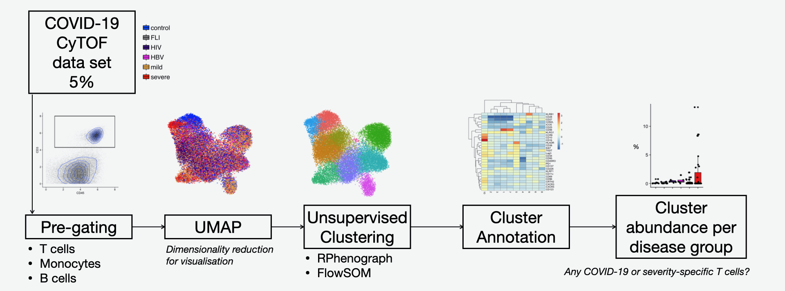

```{r setup, set.seed(1234)}
knitr::opts_chunk$set(
    fig.align = "center", message = F, warning = F, cache = T, cache.lazy = F,
    class.source = "fold-hide"
)
```


--- 

## Load libraries

If packages are already installed on your system, you could just use `library(tibble)`. Otherwise you have to install it first, here you have multiple options: 

- Standard: `install.packages("insert_your_package_name")`
- Automated: `pacman::p_load("insert_your_package_name")`
This loads your package and installs it if not already present.

Usually, the packages you install are retrieved from `CRAN`: https://cran.r-project.org/ but not all packages are hosted there. 
Especially for bio-related packages, there is `Bioconductor`: https://bioconductor.org/ 

To install packages from Bioconductor, you can either follow the instructions on the package site on Bioconductor (e.g. https://bioconductor.org/packages/release/bioc/html/ComplexHeatmap.html ) which includes installing the `BiocManager` package. 

Also `pacman` _also_ searches Bioconductor, but _only_ if BiocManager is installed before!


Some packages are neither on `CRAN` nor on `Bioconductor` but on `github`. `github` is a platform to versionize and distribute code. To install `github` packages, you can:

- Standard: `devtools::install_github("JinmiaoChenLab/Rphenograph")`
- Automated: `pacman::p_load_gh("JinmiaoChenLab/Rphenograph")`

Additionally, you might need Rtools to build R packages: https://cran.r-project.org/bin/windows/Rtools/rtools40.html
If you just installed rtools you will need to restart Rstudio.


```{r lib}

if (!require(pacman)) {
    install.packages("pacman") # If not already installed
}
pacman::p_load("tidyverse", install = TRUE)
pacman::p_load("cowplot", install = TRUE)
pacman::p_load("uwot", install = TRUE)
pacman::p_load("data.table", install = TRUE)
pacman::p_load("pheatmap", install = TRUE) # Todo
pacman::p_load("needs", install = TRUE)
pacman::p_load("knitr", install = TRUE)
pacman::p_load("ggridges", install = TRUE)
pacman::p_load("grDevices", install = TRUE)

# Install BiocManager such that pacman can then find ComplexHeatmap by its own
pacman::p_load("BiocManager", install = TRUE)
pacman::p_load("ComplexHeatmap", install = TRUE)


# Github packages have to be dealt in a special way
# However you install them, you _need_ the "devtools" package
pacman::p_load("devtools", install = TRUE)
# Additionally, you might need "Rtools"
pacman::p_load_gh("JinmiaoChenLab/Rphenograph", install = TRUE)
pacman::p_load_gh("JinmiaoChenLab/cytofkit", install = TRUE)

prioritize(dplyr)
count <- dplyr::count

theme_set(theme_classic())
```

--- 

## Overview of the tutorial

In this tutorial we will analyse a public data set ([Georg _et al._ 2021](https://www.cell.com/cell/pdf/S0092-8674(21)01562-2.pdf)) of single cell phospho-proteomics measured with Cytometry by Time of Flight (CyTOF). In this study, the authors performed CyTOF of whole blood samples from mild and severe COVID-19 patients during the acute and convalescent phase, and patients with other acute respiratory infections (Flu-like illness), as well as patients chronically infected by human immunodeficiency virus (HIV) or hepatitis B (HBV) and healthy controls. They analysed the T cell space and identified highly activated CD16+ T cells in severe COVID-19, which led the authors to hypothesise about the pathological role of these cytotoxic T cells. This hypothesis was then tested and confirmed with functional analyses, and found suitable mechanisms for their induction. In this tutorial you will learn how to perform such computational analysis either in T cells, B cells, or monocytes!

Due to time constrains, we will analyse 5% of the data set. We will start by manually pre-gating the immune cell type of interest, then we will visually explore the data by reducing the dimensionality and plotting a UMAP. After this, we will cluster the data to find discrete communities of cells, using two different algorithms for comparison. Then we will annotate/give names to these clusters by looking at the average protein expression in each community/cluster. Finally, we will calculate the abundance of each cluster per donor and identify COVID-19 or severe-specific clusters. 



--- 

## Read the data

We start reading the data table "data_norm_sub.csv" with the function `read.csv()`. 
* The data has already been pre-processed
  + calibration beads excluded (gating on Ce140 Bead channel)
  + doublets and debris excluded (gating on DNA channels and Event_length)
  + dead cells excluded (gating on Live-Dead mDOTA marker)
  + batch corrected (normalization using BatchAdjust method, linearly scales signal distributions to similar ranges using percentiles)

```{r read, results="hide"}
# results='hide' does not print messages to the generated output file

# Standard read.csv, works for most things, but fread is faster.
# data_norm_sub <- read.csv("~/Documents/INsTRuCT_workshop/data_norm_sub5.csv")

data_norm_sub_fread <- data.table::fread("../data/data_norm_sub5.csv")

# fread is a special format, such that we have to convert it first into a usual data.frame
data_norm_sub <- data.frame(data_norm_sub_fread)
```

What are the columns? What are the rows?

```{r colnamesdata}
# Show the first 5 rows and all columns --> Rows are cells, columns are features per cell
print(data_norm_sub[1:5, ])

# Then take a look at only the column names
colnames(data_norm_sub)
```

Not all features of the cell are actual cell markers. We want to subset the values to only these markers. Therefore, create a vector with the name of each measured protein (what we call "the CyTOF panel").

```{r panelandcolors, results="hide"}
panel <- colnames(data_norm_sub)[15:54]

# color_severity is a named vector which we will use later.
# #xxxxxx is a html-coded color code.
color_severity <- c(
    "healthy" = "#0449FF",
    "FLI" = "#807F7F",
    "HIV" = "#40007F",
    "HBV" = "magenta",
    "mild/moderate" = "#FFB651",
    "severe/critical" = "#F82000"
)
```

Let's look at how the values of markers are distributed:

In the CyTOF community, people commonly use the hyperbolic arcsine (asinh) transformation: 
$$
\rm asinh(x) = \ln(x + \sqrt{x^2+1})
$$


```{r panel_linear, fig.height=10, fig.width=10}
data_norm_sub %>%
    # take only 20% of the data such that the plots are generated faster
    sample_frac(0.2) %>%
    # Pivot: All columns defined by "panel" will go into two columns.
    # The values go into the new column "value"
    # The names of the columns go into the new column "marker"
    pivot_longer(names_to = "marker", values_to = "value", panel) %>%
    # start plotting, x-axis is the value
    ggplot(aes(x = value)) +
    # We want density plots, so how the values on the x-axis are distributed
    geom_density() +
    # facet_wrap splits the plots according to the specified column, here "marker"
    # scale="free" tells that the x-axis and y-axis are not the same for each plot
    facet_wrap(~marker, scale = "free")
```

We notice that these are skewed distributions: Many small values, some very large values. Therefore, it makes more sense to look at these on a logarithmic scale:


```{r panel_log, fig.height=10, fig.width=10}
# Transform all columns defined by "panel" with asinh()
data_norm_sub_trans <- data_norm_sub %>%
    # Apply asinh() on all columns defined by panel
    mutate_at(vars(panel), asinh)

data_norm_sub_trans %>%
    # take only 20% of the data such that the plots are generated faster
    sample_frac(0.2) %>%
    # Pivot: All columns defined by "panel" will go into two columns.
    # The values go into the new column "value"
    # The names of the columns go into the new column "marker"
    pivot_longer(names_to = "marker", values_to = "value", panel) %>%
    # Start plotting, define "value" as x-axis
    ggplot(aes(x = value)) +
    # Density plots, how are the values on the x-axis distributed
    geom_density() +
    # Split the plots according to the "marker" column, different axis
    facet_wrap(~marker, scale = "free")
```


--- 


## Pre-gating of monocytes

Using `ggplot()` and `geom_point()`, generate a scatter plot to decide the gates.  
We visualize just 10% of the data.

### CD45+CD3-

Exclude T cells

```{r gateMono1, fig.height=5, fig.width=5}
data_norm_sub_trans %>%
    # The plots would be overwhelmed with cells being exactly 0 (CyTOF-"ownness")
    filter(CD45 > 0, CD3 > 0) %>%
    # Use only 10% of the data
    sample_frac(0.1) %>%
    # Make a plot where the x-axis are the CD45 values, and the y-axis are the CD3 values
    ggplot(aes(x = CD45, y = CD3)) +
    # Each value will be a _point_ with a certain size
    # and a certain transparency (alpha)
    geom_point(size = 0.01, alpha = 0.1) +
    # Additionally to the points, plot the density of the points in 2 dimensions
    geom_density_2d() +
    # Plot a rectangle with the given coordinates
    # We found the coordinates by hand
    # Alpha=0 because otherwise you would have a filled rectangle
    geom_rect(mapping = aes(xmin = 1, xmax = 6.5, ymin = 0, ymax = 3.8), color = "black", alpha = 0)
```

### CD45+CD3-CD19-CD56-

Exclude B cells and NK cells

```{r gateMono2, fig.height=5, fig.width=5}
data_norm_sub_trans %>%
    # Retain all cells where the following rules apply
    filter(
        CD45 > 1,
        CD45 < 6.5,
        CD3 < 3.8,
        CD19 > 0,
        CD56 > 0
    ) %>%
    # Use only 50% of the data
    sample_frac(0.5) %>%
    # Plot CD56 (y-axis) vs CD19 (x-axis)
    ggplot(aes(x = CD19, y = CD56)) +
    # Plot points with certain size and color alpha
    geom_point(size = 0.01, alpha = 0.1) +
    # Make 2d-density plots
    geom_density_2d() +
    # Plot a rectangle
    # Alpha because geom_rect makes a filled rectangle otherwise
    geom_rect(mapping = aes(xmin = 0, xmax = 3.8, ymin = 0, ymax = 3.5), color = "black", alpha = 0)
```

### Exclude CD14-HLA.DR-

We exclude neutrophils, and end up with monocytes and dendritic cells

```{r gateMono3, fig.height=5, fig.width=5}

data_norm_sub_trans %>%
    # Retain all cells where the following rules apply
    filter(
        CD45 > 1,
        CD45 < 6.5,
        CD3 < 3.8,
        CD19 < 3.8,
        CD56 < 3.5,
        HLADR > 0,
        CD14 > 0
    ) %>%
    # Use only 50% of the data
    sample_frac(0.5) %>%
    # Plot CD14 (y-axis) vs HLADR (x-axis)
    ggplot(aes(x = HLADR, y = CD14)) +
    # Plot points with certain size and color alpha
    geom_point(size = 0.01, alpha = 0.1) +
    # Make 2d-density plots
    geom_density_2d() +
    # Plot a rectangle
    # Alpha because geom_rect makes a filled rectangle otherwise
    geom_rect(mapping = aes(xmin = 0, xmax = 7, ymin = 5.2, ymax = 9), color = "black", alpha = 0) +
    # Plot a rectangle
    # Alpha because geom_rect makes a filled rectangle otherwise
    geom_rect(mapping = aes(xmin = 3, xmax = 7, ymin = 0, ymax = 5.2), color = "black", alpha = 0)
```


<!-- #### Percentage of monocytes -->

<!-- * Add a column to the data table where each cell gets the classification Monocyte = {TRUE, FALSE} according to your gating strategy. -->
<!-- * Calculate the percentage of monocytes in each sample -->
<!-- * Visualize the percentage of monocytes grouped by severity group (use the classification "sev_merge"), using eg.: geom_boxplot, and facet by disease phase. -->


### Percentage of monocytes

We first add a column to the data table where each cell gets the classification Monocyte = {TRUE, FALSE} according to your gating strategy.  Then let's see if the percentage of T cells make sense and how it looks per disease group (variable `sev_merge`). 

```{r columnMono}
data_norm_sub_trans <- data_norm_sub_trans %>%
    # ifelse(logical_value, if TRUE, if FALSE)
    # ifelse returns the value inside if TRUE when the logical
    # value is TRUE, otherwise the other value.

    # Draw proper gates in the transformed values to get the Monocytes
    mutate(
        Monocyte = ifelse(
            CD45 > 1 &
                CD45 < 6.5 &
                CD3 < 3.8 &
                CD19 < 3.8 &
                CD56 < 3.5,
            TRUE, FALSE
        )
    )

data_norm_sub_trans <- data_norm_sub_trans %>%
    # ifelse(logical_value, if TRUE, if FALSE)
    # ifelse returns the value inside if TRUE when the logical
    # value is TRUE, otherwise the other value.

    # The logical TRUE/FALSE are iterated one by one.
    # If you provide a vector in the two further arguments,
    # the respective value is taken!
    mutate(Monocyte = ifelse(
        HLADR < 3 &
            CD14 < 5.2,
        FALSE, Monocyte
    ))
```

```{r percMono}
data_norm_sub_trans <- data_norm_sub_trans %>%
    # Factors are R-internal special vectors having "levels".
    # All values must be a value of "levels". Internally, a factor is a numeric value pointing
    # to one of the levels.
    # ggplot is smart enough to handle factors properly (better than only vectors if needed)!
    mutate(
        sev_merge = factor(
            sev_merge,
            levels = c("healthy", "FLI", "HIV", "HBV", "mild/moderate", "severe/critical")
        )
    )

data_norm_sub_trans %>%
    # count for each combination of
    #   id:             Sample id
    #   Monocyte:       If it is a Monocyte or not
    #   sev_merge:      Which severity it is (sev_merge = mild+moderate and severe+critical merged)
    #   Disease.phase:  acute or covalescent
    # How many cells there are
    # Count saves that in a new column "n"
    count(id, Monocyte, sev_merge, Disease.phase) %>%
    # tidyverse functions can leverage "groups" of data, but you have to specify first
    # what the group is defined on.
    # Here we want to group the cells based on their (sample-) id
    group_by(id) %>%
    # We grouped the table by id (the sample)
    #   Now we define perc as "n" divided by the sum of all "n"s times 100
    # This is applied _inside each group_
    # After each group has only two rows (Tcell = TRUE or FALSE)
    # This is effectively the percentage of Monocytes in each sample
    mutate(perc = n / sum(n) * 100) %>%
    # We do not need the grouping anymore, therefore remove it
    ungroup() %>%
    # Select only Monocytes (As "Monocyte" is a True/False column)
    filter(Monocyte) %>%
    # plot the just calculated percentage on the y-axis
    # And the severity on the x-axis
    # "fill" fills plots, usually used for coloring.
    ggplot(aes(y = perc, x = sev_merge, fill = sev_merge)) +
    # Make a boxplot per fill-value. That happens automatically.
    # Alpha sets the color-density
    geom_boxplot(position = position_dodge(1), alpha = 0.7) +
    # Overlay dotplot to the barplots
    geom_dotplot(
        binaxis = "y", stackdir = "center",
        position = position_dodge(1), alpha = 0.7
    ) +
    # facet_grid splits the plots according to multiple values,
    # you could even use multiple splitting-values
    # with "free_x" we allow the x-axis to vary between plots, but the y-axis is fixed.
    facet_grid(~Disease.phase, space = "free_x", scale = "free_x") +
    # Previously we defined the coloring for the severity stages, here we apply it.
    scale_fill_manual(values = color_severity) +
    # Set y-axis label
    ylab("Percentage of monocytes (%)") +
    # Set x-axis label to empty ("")
    xlab("") +
    # Remove the x-axis text and ticks.
    theme(
        axis.text.x = element_blank(),
        axis.ticks.x = element_blank()
    )
```


--- 


## UMAP {.tabset}

https://pair-code.github.io/understanding-umap/

We now compute UMAP for monocytes across all samples (acute and convalescent), and using all markers, except CD45, CD3, CD19, IgM, CD21, and IgD. 

We define a vector "sel_markers_mono" with the selected markers to be used for the calculation of the UMAP.


```{r sel_markers_mono}

# panel %in% c("text1", "text2", ...)
#   Returns a vector which is TRUE if its corresponding value in "panel"
#   is in the vector on the right and FALSE if it is not.
# ! panel %in% c("text1", "text2", ...)
#   inverts this logical vector, so FALSE if value is contained in the right, TRUE if not.
# panel[!panel %in% c("CD45", "CD3", "CD19", "CD15", "TCRgd", "CD21", "IgM", "IgD")]
#   selects the TRUE values in "panel" according to the just specified vector.
sel_markers_mono <- panel[!panel %in% c("CD45", "CD3", "CD19", "CD15", "TCRgd", "CD21", "IgM", "IgD")]
```

Before calculating the UMAP, is important we transform our data (`asinh`) and apply z-score standardization (function `scale`). Why?

```{r computeUMAP_m}

transformed_scaled_data <- data_norm_sub_trans %>%
    # Then apply scale() on all columns defined by sel_markers_mono
    mutate_at(vars(sel_markers_mono), scale)

data_mono <- transformed_scaled_data %>%
    # Filter all cells which are Monocytes
    filter(Monocyte)

UMAP_mono <- data_mono %>%
    # Select only the sel_markers_mono columns
    select(sel_markers_mono) %>%
    # Calculate UMAP with defined hyperparameters
    uwot::umap(
        # The size of local neighborhood
        n_neighbors = 30,
        # The effective scale of embedded points. In combination with min_dist,
        # this determines how clustered/clumped the embedded points are.
        spread = 1,
        # The effective minimum distance between embedded points
        min_dist = 0.5,
        # Type of distance metric to use to find nearest neighbors
        metric = "euclidean",
        # If TRUE, log details to the console.
        verbose = TRUE,
        # Setting fast_sgd to TRUE will speed up the stochastic optimization phase, but give a
        # potentially less accurate embedding, and which will not be exactly reproducible
        # even with a fixed seed.
        fast_sgd = TRUE
    )

data_mono$UMAP1 <- NA
data_mono$UMAP2 <- NA

data_mono$UMAP1 <- UMAP_mono[, 1]
data_mono$UMAP2 <- UMAP_mono[, 2]
```


We now plot each UMAP, coloured by severity, disease phase, and intensity of a selected marker. Recommendation: subsample cells for visualization, using _sample_n_, or _sample_frac_. 

### Severity

Do you observe specific areas where CV19 samples accumulate? What does this mean?

```{r UMAP_severity, fig.height=5, fig.width=5}
data_mono %>%
    # Sample 30000 rows (=cells)
    sample_n(30000) %>%
    # Plot the two just calculated UMAPs, color according to sev_merge(severity)
    ggplot(aes(x = UMAP1, y = UMAP2, color = sev_merge)) +
    # Plot points
    geom_point(alpha = 0.5, size = 0.5) +
    # Bigger and not transparent dots for the legend
    guides(colour = guide_legend(ncol = 1, override.aes = list(size = 3, alpha = 1))) +
    # Use our previously defined colors
    scale_color_manual(values = color_severity, name = "") +
    # Set a proper title!
    # Always set proper titles. The idea is that you should be able to send a plot to you boss and
    # he should understand what happens by just looking at the plot.
    ggtitle("Monocytes") +
    # legend.position="none" removes the legend
    # plot.title = element_text(hjust...) adjusts the horizontal adjustment (placing) of the title.
    theme(legend.position = "none", plot.title = element_text(hjust = 0.5))
```

### Disease phase

Do you observe specific areas where convalescent samples accumulate? What does this mean?

```{r UMAP_diseasephase_m, fig.height=5, fig.width=5}

data_mono %>%
    # Sample 30000 rows (=cells)
    sample_n(30000) %>%
    # Plot the two just calculated UMAPs, color according to Disease.phase
    ggplot(aes(x = UMAP1, y = UMAP2, color = Disease.phase)) +
    # Plot points
    geom_point(alpha = 0.5, size = 0.5) +
    # Bigger and not transparent dots for the legend
    guides(colour = guide_legend(ncol = 1, override.aes = list(size = 3, alpha = 1))) +
    # Define manual colors. We defined that the column "Disease.phase" should define the color
    # Inside Disease.phase are the values "acute" and "convalescent"
    # With scale_color_manual we can explicitly define which color they should get.
    scale_color_manual(values = c("acute" = "red", "convalescent" = "black"), name = "") +
    # Center the plot title
    theme(plot.title = element_text(hjust = 0.5))
```

### Marker intensity

* Plot the UMAPs coloured by the expression of your favorite marker.

```{r UMAP_markers_m, fig.height=7, fig.width=21}


p1 <- data_mono %>%
    # Subsample 30000 cells
    sample_n(30000) %>%
    # Plot the two just calculated UMAPs, color according to HLADR values
    ggplot(aes(x = UMAP1, y = UMAP2, color = HLADR)) +
    # Make points
    geom_point(alpha = 0.5, size = 0.5) +
    # Center the plot title
    theme(plot.title = element_text(hjust = 0.5)) +
    # scale_color_gradient2 sets the color-scale for the aes "color"
    # Where you can define which colors low, mid and high values should have
    # Then it makes two color-gradients:
    #   low -> mid
    #   mid -> low
    # Mixing the colors appropriately according to the value of the given column in aes()
    scale_color_gradient2(low = "blue", mid = "grey", high = "red", midpoint = 0)


p2 <- data_mono %>%
    # Subsample 30000 cells
    sample_n(30000) %>%
    # Plot the two just calculated UMAPs, color according to CD16 values
    ggplot(aes(x = UMAP1, y = UMAP2, color = CD16)) +
    # Make points
    geom_point(alpha = 0.5, size = 0.5) +
    # Center the plot title
    theme(plot.title = element_text(hjust = 0.5)) +
    # scale_color_gradient2 sets the color-scale for the aes "color"
    # Where you can define which colors low, mid and high values should have
    # Then it makes two color-gradients:
    #   low -> mid
    #   mid -> low
    # Mixing the colors appropriately according to the value of the given column in aes()
    scale_color_gradient2(low = "blue", mid = "grey", high = "red", midpoint = 0)


p3 <- data_mono %>%
    # Subsample 30000 cells
    sample_n(30000) %>%
    # Plot the two just calculated UMAPs, color according to CD14 values
    ggplot(aes(x = UMAP1, y = UMAP2, color = CD14)) +
    # Make points
    geom_point(alpha = 0.5, size = 0.5) +
    # Center the plot title
    theme(plot.title = element_text(hjust = 0.5)) +
    # scale_color_gradient2 sets the color-scale for the aes "color"
    # Where you can define which colors low, mid and high values should have
    # Then it makes two color-gradients:
    #   low -> mid
    #   mid -> low
    # Mixing the colors appropriately according to the value of the given column in aes()
    scale_color_gradient2(low = "blue", mid = "grey", high = "red", midpoint = 0)

plot_grid(p1, p2, p3, nrow = 1)
```


--- 


## Unsupervised clustering  {.tabset}

We now perform unsupervised clustering analysis on samples from control, FLI, HIV, HBV, and acute COVID-19 using  the selected markers. As done for the UMAP calculation, before clustering is important we transform and z-score normalize our data. Let's look at the distribution of the markers used for clustering:

```{r distMarkersClust, fig.height=10, fig.width=10}
data_mono %>%
    # Keep cells from "acute" disease phase
    filter(Disease.phase == "acute") %>%
    # Keep only the columns defined by sel_markers_mono
    select(sel_markers_mono) %>%
    # Make the table from wide to long format
    # The previous column names go into the new column "marker"
    # The previous column's _values_ go into the new column "marker"
    # And this should be applied to all (everything()) previous columns
    pivot_longer(names_to = "marker", values_to = "value", everything()) %>%
    # "value" on the x-axis
    ggplot(aes(x = value)) +
    # Make density plots
    geom_density() +
    # Split the plots according to the "marker" value, scale them freely
    facet_wrap(~marker, scale = "free")
```

**What's the main difference between RPhenograph and FlowSOM?**

### Run {.tabset}

#### RPhenograph 

**IMPORTANT!** In RPhenograph we define the number of nearest neighbours. 

```{r runRphenograph, results="hide"}
# Sys.time() returns the current time on your PC
start_time <- Sys.time()

clust_mono_rpheno <- data_mono %>%
    # Keep cells from "acute" disease phase
    filter(Disease.phase == "acute") %>%
    # Keep only the columns defined by sel_markers_mono
    select(sel_markers_mono) %>%
    # Start clustering with Rphenograph
    # k: number of nearest neighbours (default:30)
    Rphenograph(k = 30)

# Sys.time() returns the current time on your PC
end_time <- Sys.time()
```

```{r time_elapsed_Rpheno}
# with difftime you can calculate the difference between two times received by Sys.time()
# You can also supply the unit you want to see (here "minutes")
#
# as.numeric() then makes a PC-usable number from that
# and round(..., 2) rounds to the second place after comma
time_elapsed <- round(as.numeric(difftime(end_time, start_time, units = "mins")), 2)

# paste() combines multiple strings together in R
# "\n" is a special string to make a new line when
# cat() is used to actually print to console
print(paste("\n", time_elapsed, "minutes passed"))
```

After running the clustering algorithm, we add a column "Rpheno" in the data table with the cluster label for each cell:

```{r add_clust_info}
clust_ids <- data_mono %>%
    # Keep cells from "acute" disease phase
    filter(Disease.phase == "acute") %>%
    # Extract the column "cellid" from the dataframe as a usual vector
    # This column uniquely identifies each cell
    pull(cellid)

# Make a new tibble (table) with two columns:
#   "cellid": The (unique!) cell ids
#   "Rpheno": The cluster assignment for each of the cells
clust_mono_rpheno <- tibble(
    cellid = clust_ids,
    Rpheno = as.character(igraph::membership(clust_mono_rpheno))
)

# left_join here joins automatically by the column "cellid"
# So the column "cellid" is taken as identifier and the transformed_scaled_data is extended by the
# column "Rpheno", so the cluster assignment by Rpheno
data_mono <- data_mono %>% left_join(clust_mono_rpheno)

# We will use Rpheno later in plots and want to have sorted cluster numbers.
# ggplot can only do that when the column is a factor
# If the column is a factor, the ordering of values is according to its levels
data_mono <- data_mono %>%
    mutate(Rpheno = factor(Rpheno, levels = str_sort(unique(Rpheno), numeric = TRUE)))
```

#### FlowSOM

**IMPORTANT!** In FlowSOM we define the number of clusters.

```{r runflowsom, results="hide"}
# Sys.time() returns the current time on your PC
start_time <- Sys.time()

clust_mono_flowsom <- data_mono %>%
    # Keep cells from "acute" disease phase
    filter(Disease.phase == "acute") %>%
    # Keep only the columns defined by sel_markers_mono
    select(sel_markers_mono) %>%
    # Start clustering with FlowSOM (from the cytofkit package)
    cytofkit::cytof_cluster(
        # %>% usually "pipes" the data into the FIRST argument of the called function
        # but here we want to leave the first argument ("ydata") free, so we have to define
        # it explicitely.
        # To then "access" the piped data you can use the dot (.)
        xdata = .,
        # Specify the used method, here FlowSOM
        method = "FlowSOM",
        # Number of clusters for meta clustering in FlowSOM.
        FlowSOM_k = 10
    )

# Sys.time() returns the current time on your PC
end_time <- Sys.time()
```

```{r time_elapsed_fs}
# with difftime you can calculate the difference between two times received by Sys.time()
# You can also supply the unit you want to see (here "minutes")
#
# as.numeric() then makes a PC-usable number from that
# and round(..., 2) rounds to the second place after comma
time_elapsed <- round(as.numeric(difftime(end_time, start_time, units = "mins")), 2)

# paste() combines multiple strings together in R
# "\n" is a special string to make a new line when
# cat() is used to actually print to console
print(paste("\n", time_elapsed, "minutes passed"))
```

After running the clustering algorithm, we add a column "flowsom" in the data table with the cluster label for each cell:

```{r add_clust_info_fs}
clust_ids <- data_mono %>%
    # Keep cells from "acute" disease phase
    filter(Disease.phase == "acute") %>%
    # Extract the column "cellid" from the dataframe as a usual vector
    # This column uniquely identifies each cell
    pull(cellid)

# Make a new tibble (table) with two columns:
#   "cellid": The (unique!) cell ids
#   "flowsom": The cluster assignment for each of the cells
clust_mono_flowsom <- tibble(
    cellid = clust_ids,
    flowsom = as.character(clust_mono_flowsom)
)

# left_join here joins automatically by the column "cellid"
# So the column "cellid" is taken as identifier and the transformed_scaled_data is extended by the
# column "flowsom", so the cluster assignment by flowsom
data_mono <- data_mono %>% left_join(clust_mono_flowsom)
data_mono <- data_mono %>%
    # We will use flowsom later in plots and want to have sorted cluster numbers.
    # ggplot can only do that when the column is a factor
    # If the column is a factor, the ordering of values is according to its levels
    mutate(flowsom = factor(flowsom, levels = str_sort(unique(flowsom), numeric = TRUE)))
```

### Cluster size {.tabset}

We now visualize the number of cells in each cluster:

#### Rphenograph

```{r clustSize, fig.height=5, fig.width=10}
data_mono %>%
    # Keep cells from "acute" disease phase
    filter(Disease.phase == "acute") %>%
    # Count the number of rows (cells) per value in the Rpheno (cluster-id) column
    count(Rpheno) %>%
    # Plot
    #   - Rpheno column (cluster-id) on the x-axis
    #   - Number of cells per Rpheno on y-axis
    #   - Use the number of cells as label
    ggplot(aes(x = Rpheno, y = n, label = n)) +
    # Make a bar chart
    geom_col(position = "dodge") +
    # Add labels on each bar
    geom_label()
```

#### FlowSOM

```{r clustSize_fs, fig.height=5, fig.width=10}
data_mono %>%
    # Keep cells from "acute" disease phase
    filter(Disease.phase == "acute") %>%
    # Count the number of rows (cells) per value in the flowsom (cluster-id) column
    count(flowsom) %>%
    # Plot
    #   - flowsom column (cluster-id) on the x-axis
    #   - Number of cells per flowsom on y-axis
    #   - Use the number of cells as label
    ggplot(aes(x = flowsom, y = n, label = n)) +
    # Make a bar chart
    geom_col(position = "dodge") +
    # Add labels on each bar
    geom_label()
```

### UMAP clusters {.tabset}

And then plot the UMAP, this time coloured by cluster:

#### RPhenograph

```{r UMAP_clusters_Rpheno, fig.height=5, fig.width=7}
data_mono %>%
    # Keep cells from "acute" disease phase
    filter(Disease.phase == "acute") %>%
    # Plot the two just calculated UMAPs, color according to Rphenograph clusters
    ggplot(aes(x = UMAP1, y = UMAP2, color = Rpheno)) +
    # Plot points with transparency and size defined
    geom_point(alpha = 0.5, size = 1) +
    # Bigger and not transparent dots for the legend
    guides(colour = guide_legend(ncol = 1, override.aes = list(size = 3, alpha = 1))) +
    # Setting proper title
    ggtitle("Monocytes") +
    # Center the plot title
    theme(plot.title = element_text(hjust = 0.5))
```

#### FlowSOM

```{r UMAP_clusters_fs, fig.height=5, fig.width=7}
data_mono %>%
    # Keep cells from "acute" disease phase
    filter(Disease.phase == "acute") %>%
    # Plot the two just calculated UMAPs, color according to flowsom clusters
    ggplot(aes(x = UMAP1, y = UMAP2, color = flowsom)) +
    # Plot points with transparency and size defined
    geom_point(alpha = 0.5, size = 1) +
    # Bigger and not transparent dots for the legend
    guides(colour = guide_legend(ncol = 1, override.aes = list(size = 3, alpha = 1))) +
    # Setting proper title
    ggtitle("Monocytes") +
    # Center the plot title
    theme(plot.title = element_text(hjust = 0.5))
```

### Marker distribution {.tabset}

Let's look at the marker distribution per cluster: 

#### RPhenograph

```{r distMarkersClust_rpheno, fig.height=15, fig.width=10}
data_mono %>%
    # Keep cells from "acute" disease phase
    filter(Disease.phase == "acute") %>%
    # Keep only the columns defined by sel_markers_mono _and_ Rpheno
    select(sel_markers_mono, Rpheno) %>%
    # Make the table from wide to long format
    # The previous column names go into the new column "marker"
    # The previous column's _values_ go into the new column "marker"
    # And this should be applied to the columns defined by sel_markers_mono
    pivot_longer(names_to = "marker", values_to = "value", sel_markers_mono) %>%
    # x-axis:       Marker values
    # y-axis:       Cluster ids
    # fill-color:   Cluster ids
    ggplot(aes(x = value, fill = Rpheno, y = Rpheno)) +
    # geom_density_ridges plots a density plot for each value defined by y
    geom_density_ridges() +
    # Make the same kind of multi-density-plot for each marker!
    facet_wrap(~marker, scale = "free")
```

#### FlowSOM

```{r distMarkersClust_flowsom, fig.height=15, fig.width=10}
data_mono %>%
    # Keep cells from "acute" disease phase
    filter(Disease.phase == "acute") %>%
    # Keep only the columns defined by sel_markers_mono _and_ flowsom
    select(sel_markers_mono, flowsom) %>%
    # Make the table from wide to long format
    # The previous column names go into the new column "marker"
    # The previous column's _values_ go into the new column "marker"
    # And this should be applied to the columns defined by sel_markers_mono
    pivot_longer(names_to = "marker", values_to = "value", sel_markers_mono) %>%
    # x-axis:       Marker values
    # y-axis:       Cluster ids
    # fill-color:   Cluster ids
    ggplot(aes(x = value, fill = flowsom, y = flowsom)) +
    # geom_density_ridges plots a density plot for each value defined by y
    geom_density_ridges() +
    # Make the same kind of multi-density-plot for each marker!
    facet_wrap(~marker, scale = "free")
```


--- 

## Cluster annotation {.tabset}

We now want to actually understand what are these clusters we found. For this, we can visualize the average expression of each marker in each cluster with a heatmap.

### Heatmap (ggplot) {.tabset}

#### Rphenograph

```{r heatmapClusters, fig.height=5, fig.width=5}

data_mono %>%
    # Keep cells from "acute" disease phase
    filter(Disease.phase == "acute") %>%
    # Keep only the columns defined by sel_markers_mono _and_ Rpheno
    select(sel_markers_mono, Rpheno) %>%
    # group by Rpheno-clusters
    group_by(Rpheno) %>%
    # Summarise_at "summarises" all rows (per group!) using the functions defined in list()
    # "~mean(...)" is a so-called lambda function (anonymous)
    # In essence: Calculate the mean _per marker_ inside each cluster (because group_by)
    summarise_at(vars(sel_markers_mono), list(mean(., na.rm = TRUE))) %>%
    # Make the table from wide to long format
    # The previous column names go into the new column "marker"
    # The previous column's _values_ go into the new column "marker"
    # And this should be applied to all columns EXCEPT Rpheno (the "-" tells that)
    pivot_longer(names_to = "markers", values_to = "avg_zscore", -Rpheno) %>%
    # Modify the column "markers" into being a factor with a specified order of levels
    # (the reverse order from sel_markers_mono)
    mutate(markers = factor(markers, levels = rev(sel_markers_mono))) %>%
    # Start plot:
    #   - x-axis:       Cluster
    #   - y-axis:       The marker
    #   - fill color:   The just calculated average score
    ggplot(aes(x = Rpheno, y = markers, fill = avg_zscore)) +
    # Make a heatmap
    geom_tile() +
    # Replace the default color scale
    scale_fill_gradient2(low = "blue", mid = "white", high = "red", limits = c(-5.5, 5.5))
```

#### FlowSOM

```{r heatmapClusters_fs, fig.height=5, fig.width=5}
data_mono %>%
    # Keep cells from "acute" disease phase
    filter(Disease.phase == "acute") %>%
    # Keep only the columns defined by sel_markers_mono _and_ flowsom
    select(sel_markers_mono, flowsom) %>%
    # group by flowsom-clusters
    group_by(flowsom) %>%
    # Summarise_at "summarises" all rows (per group!) using the functions defined in list()
    # "~mean(...)" is a so-called lambda function (anonymous)
    # In essence: Calculate the mean _per marker_ inside each cluster (because group_by)
    summarise_at(vars(sel_markers_mono), list(mean(., na.rm = TRUE))) %>%
    # Make the table from wide to long format
    # The previous column names go into the new column "marker"
    # The previous column's _values_ go into the new column "marker"
    # And this should be applied to all columns EXCEPT flowsom (the "-" tells that)
    pivot_longer(names_to = "markers", values_to = "avg_zscore", -flowsom) %>%
    # Modify the column "markers" into being a factor with a specified order of levels
    # (the reverse order from sel_markers_mono)
    mutate(markers = factor(markers, levels = rev(sel_markers_mono))) %>%
    # Start plot:
    #   - x-axis:       Cluster
    #   - y-axis:       The marker
    #   - fill color:   The just calculated average score
    ggplot(aes(x = flowsom, y = markers, fill = avg_zscore)) +
    # Make a heatmap
    geom_tile() +
    # Replace the default color scale
    scale_fill_gradient2(low = "blue", mid = "white", high = "red", limits = c(-5.5, 5.5))
```

### Heatmap (pheatmap) {.tabset}

With the library "pheatmap" we can additionally group the clusters (dendogram) and group the markers by category (annotation).

#### RPhenograph

```{r heatmapClusters_pheatmap, fig.height=5, fig.width=5}

data_heatmap <- data_mono %>%
    # Keep cells from "acute" disease phase
    filter(Disease.phase == "acute") %>%
    # Keep only the columns defined by sel_markers_mono _and_ Rpheno
    select(sel_markers_mono, Rpheno) %>%
    # group by Rpheno-clusters
    group_by(Rpheno) %>%
    # Summarise_at "summarises" all rows (per group!) using the functions defined in list()
    # "~mean(...)" is a so-called lambda function (anonymous)
    # In essence: Calculate the mean _per marker_ inside each cluster (because group_by)
    summarise_at(vars(sel_markers_mono), list(mean(., na.rm = TRUE))) %>%
    # tibbles usually do not have row-names, but some (usually classical) functions
    # make use of the rownames
    # Therefore, let's make the Rpheno-column the rownames!
    column_to_rownames("Rpheno")

annotation_rows <- data.frame(marker_category = c(
    "Contamination",
    rep("Differentiation", 2),
    rep("Co-stimulation", 4),
    rep("Co-inhibition", 4),
    rep("Activation", 7),
    rep("Chemokine receptor", 4),
    rep("Others", 10)
))

# The sel_markers_mono should be the rownames of the annotations
rownames(annotation_rows) <- sel_markers_mono

data_heatmap %>%
    # t() transposes data_heatmap
    # apart from that it automatically converts the tibble into a matrix
    t() %>%
    pheatmap(
        # Do not cluster the rows when plotting
        cluster_rows = FALSE,
        # Do cluster the columns when plotting
        cluster_cols = TRUE,
        # Add the annotation per row
        annotation_row = annotation_rows,
        # Do not show the annotation_row column name
        annotation_names_row = FALSE,
        # vector of row indices that show where to put gaps into heatmap. Used only if the rows are not clustered. See cutree_row to see how to introduce gaps to clustered rows.
        gaps_row = c(1, 3, 7, 11, 18, 22),
        # a sequence of numbers that covers the range of values in mat and
        # is one element longer than color vector.
        # Used for mapping values to colors.
        breaks = seq(-5.5, 5.5, length.out = 100),
        # For every value in "breaks", generate a corresponding color value with colorRampPalette
        # This then goes
        #   blue (minimum) -> white (midpoint) -> red (maximum)
        color = colorRampPalette(c("blue", "white", "red"))(100)
    )
```

#### FlowSOM

```{r heatmapClusters_pheatmap_fs, fig.height=5, fig.width=5}

data_heatmap <- data_mono %>%
    # Keep cells from "acute" disease phase
    filter(Disease.phase == "acute") %>%
    # Keep only the columns defined by sel_markers_mono _and_ flowsom
    select(sel_markers_mono, flowsom) %>%
    # group by flowsom-clusters
    group_by(flowsom) %>%
    # Summarise_at "summarises" all rows (per group!) using the functions defined in list()
    # "~mean(...)" is a so-called lambda function (anonymous)
    # In essence: Calculate the mean _per marker_ inside each cluster (because group_by)
    summarise_at(vars(sel_markers_mono), list(mean(., na.rm = TRUE))) %>%
    # tibbles usually do not have row-names, but some (usually classical) functions
    # make use of the rownames
    # Therefore, let's make the flowsom-column the rownames!
    column_to_rownames("flowsom")

annotation_rows <- data.frame(marker_category = c(
    "Contamination",
    rep("Differentiation", 2),
    rep("Co-stimulation", 4),
    rep("Co-inhibition", 4),
    rep("Activation", 7),
    rep("Chemokine receptor", 4),
    rep("Others", 10)
))

# The sel_markers_mono should be the rownames of the annotations
rownames(annotation_rows) <- sel_markers_mono

data_heatmap %>%
    # t() transposes data_heatmap
    # apart from that it automatically converts the tibble into a matrix
    t() %>%
    pheatmap(
        # Do not cluster the rows when plotting
        cluster_rows = FALSE,
        # Do cluster the columns when plotting
        cluster_cols = TRUE,
        # Add the annotation per row
        annotation_row = annotation_rows,
        # Do not show the annotation_row column name
        annotation_names_row = FALSE,
        # vector of row indices that show where to put gaps into heatmap. Used only if the rows are not clustered. See cutree_row to see how to introduce gaps to clustered rows.
        gaps_row = c(1, 3, 7, 11, 18, 22),
        # a sequence of numbers that covers the range of values in mat and
        # is one element longer than color vector.
        # Used for mapping values to colors.
        breaks = seq(-5.5, 5.5, length.out = 100),
        # For every value in "breaks", generate a corresponding color value with colorRampPalette
        # This then goes
        #   blue (minimum) -> white (midpoint) -> red (maximum)
        color = colorRampPalette(c("blue", "white", "red"))(100)
    )
```


### Quick comparison

How much percentage of cells from RPhenograph cluster X where classified in FlowSOM cluster Y?

```{r}

data_heatmap <- data_mono %>%
    # Keep cells from "acute" disease phase
    filter(Disease.phase == "acute") %>%
    # count for each combination of
    #   Rpheno:     Cluster from Rphenograph
    #   flowsom:    Cluster from flowsom
    # How many cells there are
    # Count saves that in a new column "n"
    count(Rpheno, flowsom) %>%
    # When using the function count(), if a cluster is absent in a donor, it will not be counted as zero.
    # So we complete the count table by filling the missing clusters with a 0.
    tidyr::complete(Rpheno, flowsom, fill = list(n = 0)) %>%
    # group by Rpheno-clusters
    group_by(Rpheno) %>%
    # due to the grouping, sum(n) gets the number of cells in each Rpheno-cluster
    mutate(total_Rpheno = sum(n)) %>%
    # Remove the grouping
    ungroup() %>%
    # Get the percentage of cells (per row) in total_Rpheno
    # After total_Rpheno was calculated per Rpheno-cluster this results in the percentage
    # of cells of each flowSOM cluster being in the respective Rpheno-cluster
    mutate(perc = n / total_Rpheno * 100) %>%
    # Select only the columns Rpheno, flowsom, perc
    select(Rpheno, flowsom, perc) %>%
    # Now generate a matrix-like visualization by moving the Rpheno-column into separate columns
    # based on the Rpheno-value
    pivot_wider(names_from = Rpheno, values_from = "perc") %>%
    # Move the flowsom column to the rownames.
    column_to_rownames("flowsom")

pheatmap(
    data_heatmap,
    # Do cluster the rows when plotting
    cluster_rows = TRUE,
    # Do cluster the columns when plotting
    cluster_cols = TRUE,
    # Create custom labels for the rows
    labels_row = paste0(rownames(data_heatmap), "_flowsom"),
    # Create custom labels for the columns
    labels_col = paste0(rownames(data_heatmap), "_rpheno")
)
```

--- 


## Cluster abundance {.tabset}

Finally, we can calculate the abundance of each cluster in each sample and check if there are COVID-specific or severity-specific groups of cells.  

**ACHTUNG!** In this data set, donors where sampled multiple times during the disease course. We establish an arbitrary rule of choosing the first sample per donor (usually during the first week post-symptom onset) if multiple samples are available.


```{r defineIDs}
selected_ids <- data_mono %>%
    # Keep cells from "acute" disease phase
    filter(Disease.phase == "acute") %>%
    # count for each combination of
    #   Individuals:              Patient id (there are potentially multiple samples per patient)
    #   id:                       Sample id
    #   Group:                    "HC"   "CV19" "HBV"  "HIV"  "FLI"
    #   sev_merge:                Which severity it is (sev_merge = mild+moderate and severe+critical merged)
    #   Days.post.symptom.onset:  Time of measurement after symptom onset
    # How many cells there are
    # Count saves that in a new column "n"
    count(Individuals, id, Group, sev_merge, Days.post.symptom.onset) %>%
    # Remove the "n" column
    select(-n) %>%
    # Group by Individual
    group_by(Individuals) %>%
    # Inside each Individual, create a new column "n_samples"
    # which always starts from 1 and goes up to the number of samples of that individual (which is the number of rows in that group)
    mutate(n_samples = 1:n()) %>%
    # Select the id where the Days.post.symptom.onset is the minimum
    mutate(select_id = ifelse(n_samples == 1, TRUE,
        ifelse(min(as.numeric(Days.post.symptom.onset)) == as.numeric(Days.post.symptom.onset),
            TRUE,
            FALSE
        )
    )) %>%
    # Get only the rows where select_id column is TRUE
    filter(select_id) %>%
    # Get the ids
    pull(id)
```

We can visualize the abundance of each cluster per donor as boxplots per severity group. 

### RPhenograph


```{r boxplot_clust_abundance, fig.height=10, fig.width=10}

data_mono %>%
    # Keep all samples (id) which are in the selected_ids
    filter(id %in% selected_ids) %>%
    # count for each combination of
    #   id:                 Sample id
    #   sev_merge:          Which severity it is (sev_merge = mild+moderate and severe+critical merged)
    #   Rpheno:             Cluster from Rphenograph
    # How many cells there are
    # Count saves that in a new column "n"
    count(id, sev_merge, Rpheno) %>%
    # Group by sample ID
    group_by(id) %>%
    # Get the percentage of rows per group (so... per sample)
    mutate(perc = n / sum(n) * 100) %>%
    # Remove grouping
    ungroup() %>%
    # When using the function count(), if a cluster is absent in a donor, it will not be counted as zero.
    # So we complete the count table by filling the missing clusters with a 0.
    tidyr::complete(id, Rpheno, fill = list(n = 0, perc = 0)) %>%
    # Group per sample
    group_by(id) %>%
    # after we grouped per sample, each sample has its own sev_merge value for all clusters!
    mutate(sev_merge = unique(sev_merge[!is.na(sev_merge)])) %>%
    # Remove grouping
    ungroup() %>%
    # Plot:
    #   x-axis:     sev_merge
    #   y-axis:     percentage of cells in the cluster
    #   fill color: sev_merge
    ggplot(aes(x = sev_merge, y = perc, fill = sev_merge)) +
    # Make boxplots
    geom_boxplot() +
    # Add the values as points
    geom_jitter() +
    # Split the previous plot into each separate cluster
    facet_wrap(~Rpheno, scale = "free") +
    # Previously we defined the coloring for the severity stages, here we apply it.
    scale_fill_manual(values = color_severity) +
    # Remove the x-axis text
    theme(axis.text.x = element_blank()) +
    # Set a title
    ggtitle("RPhenograph cluster abundance")
```

### FlowSOM

```{r boxplot_clust_flow_abundance, fig.height=10, fig.width=10}
data_mono %>%
    # Keep all samples (id) which are in the selected_ids
    filter(id %in% selected_ids) %>%
    # count for each combination of
    #   id:                 Sample id
    #   sev_merge:          Which severity it is (sev_merge = mild+moderate and severe+critical merged)
    #   flowsom:             Cluster from flowsom
    # How many cells there are
    # Count saves that in a new column "n"
    count(id, sev_merge, flowsom) %>%
    # Group by sample ID
    group_by(id) %>%
    # Get the percentage of rows per group (so... per sample)
    mutate(perc = n / sum(n) * 100) %>%
    # Remove grouping
    ungroup() %>%
    # When using the function count(), if a cluster is absent in a donor, it will not be counted as zero.
    # So we complete the count table by filling the missing clusters with a 0.
    tidyr::complete(id, flowsom, fill = list(n = 0, perc = 0)) %>%
    # Group per sample
    group_by(id) %>%
    # after we grouped per sample, each sample has its own sev_merge value for all clusters!
    mutate(sev_merge = unique(sev_merge[!is.na(sev_merge)])) %>%
    # Remove grouping
    ungroup() %>%
    # Plot:
    #   x-axis:     sev_merge
    #   y-axis:     percentage of cells in the cluster
    #   fill color: sev_merge
    ggplot(aes(x = sev_merge, y = perc, fill = sev_merge)) +
    # Make boxplots
    geom_boxplot() +
    # Add the values as points
    geom_jitter() +
    # Split the previous plot into each separate cluster
    facet_wrap(~flowsom, scale = "free") +
    # Previously we defined the coloring for the severity stages, here we apply it.
    scale_fill_manual(values = color_severity) +
    # Remove the x-axis text
    theme(axis.text.x = element_blank()) +
    # Set a title
    ggtitle("FlowSom cluster abundance")
```


--- 


## Now is your turn

Make a presentation/talk (up to 20 minutes long, 10 minutes discussion) about the analysis pipeline that you familiarized yourself with. Mention what cell type you looked at, and present the results with your interpretation given the context of the experimental design.  

Doesn't have to be a proper PowerPoint, you can just open the R Markdown and go through it.  

Following questions should be touched upon:  

* Pre-gating: 
  + What is the purpose of doing it? 
  + List pros and cons

* UMAP: 
  + What information does it carry? 
  + In what ways can we use it in exploratory analysis?
  
*	Unsupervised Clustering: 
  + What are the differences between algorithms?
  + Which one gave better results?
  + What are the situations where you would prefer using the other one?
  
* Cluster annotation
  + Which names would you give to the clusters we found?

* Interpretation of results in the context of acute COVID-19 using heatmaps and cluster abundances.
* Future plans: 
    - Are there projects where you need to apply clustering?
    - Have you worked with cytometry data already?
    - What do you usually use for cytometry analysis?
    - Are pou planning to change to R for certain steps in your analysis?
    - What would be necessary to change to R? More training, more time to get familiar with, etc.?
    - Do you see advantages of R compared to your usual analysis-suite?

```{r }
print("Done")
print(session_info())
```


